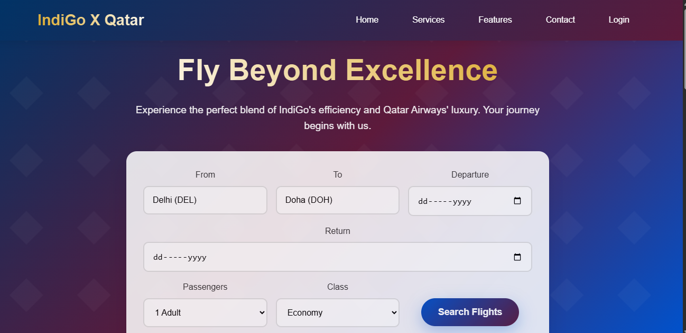

IndiGo Qatar - Premium Air Travel 🌍✈️

A responsive landing page that combines IndiGo Airlines’ efficiency with Qatar Airways’ luxury, built using HTML and CSS.

🚀 Features

Fixed Header & Navigation – Smooth scrolling navigation bar.

Hero Section – Gradient background with animated text and booking form.

Flight Booking Form – Input fields for departure, return, passengers, and class.

Services Section – Highlighting premium travel services.

Features Section – Showcasing airline advantages (on-time, Wi-Fi, dining, etc.).

Responsive Design – Works seamlessly on mobile, tablet, and desktop.

Footer – Quick links, destinations, support, and about sections.

🛠️ Technologies Used

HTML5 – Semantic structure for layout and content.

CSS3 – Styling with gradients, animations, grid, and flexbox.

📸 Preview

live demo:
